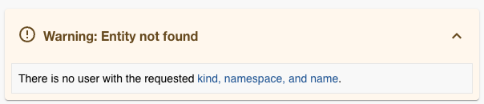

# Backstage

Backstage is an open platform for building developer portals. Powered by a
centralized service catalog, Backstage restores order to your microservices and
infrastructure.

## Getting Started with Backstage

Once you log into Backstage with your Broad Account
you are able to access *most* of the features of Backstage. For example,
searching the catalog, techdocs, and other core functionality.
However there a a few features that require additional setup since they are connected
to GitHub resources or services.

### Connecting to GitHub

To fully onboard please follow the instructions in the
[GitHub Onboarding Guide](https://intranet.broadinstitute.org/bits/service-catalog/software-development-support/github)
The two steps that are required are:

* Linking your [GitHub account to your Broad Account](github.broadinstitute.org)
* Add your [Broad Email to your GitHub account](https://docs.github.com/en/account-and-profile/setting-up-and-managing-your-personal-account-on-github/managing-email-preferences/adding-an-email-address-to-your-github-account)

Once your email address is added to your GitHub account, Backstage will be able to correctly identify you.

If you'd like to check and see if your GitHub account is correctly onboarded, you can visit the
[Backstage Settings page](https://backstage.broadinstitute.org/settings) click on your username
next to `User Entity: `  if you see this error message, you need to add your Broad email to your GitHub account.

# don't merge me 
