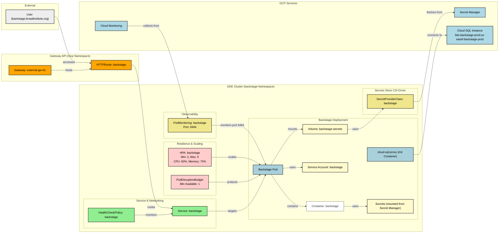

# Kubernetes Deployment

This diagram represents the Kubernetes deployment architecture for Backstage on
GKE, including all core components, policies, and integrations.

## Deployment Components

### Core Components

- **Deployment**: Runs 2 replicas with autoscaling up to 5 pods
- **Service**: Exposes Backstage on port 80 (targets port 7007)
- **Pod**: Runs backstage container with cloud-sql-proxy init container

### Resilience Policies

- **HorizontalPodAutoscaler**: Scales based on CPU (60%) and memory (75%)
  utilization
- **PodDisruptionBudget**: Ensures minimum 1 replica available during
  disruptions
- **HealthCheckPolicy**: Monitors service health via HTTP readiness probe

### Networking

- **HTTPRoute**: Gateway API resource routing traffic to backstage service
- **External Gateway**: `external-gw-01` in the `mcp` namespace handles ingress

### Security & Secrets

- **ServiceAccount**: `backstage@bits-backstage-prod.iam.gserviceaccount.com`
  for Workload Identity
- **SecretProviderClass**: Mounts secrets from GCP Secret Manager via CSI driver
- **Secrets**: GitHub, Google, PagerDuty credentials and Slack/Soundcheck tokens

### Observability

- **PodMonitoring**: Prometheus-style metrics collection on port 9464
- **Cloud Monitoring**: Integration with GCP monitoring

### Data

- **Cloud SQL**: PostgreSQL instance at
  `bits-backstage-prod:us-east4:backstage-prod`
- **cloud-sql-proxy**: Secure connection via IAM authentication
