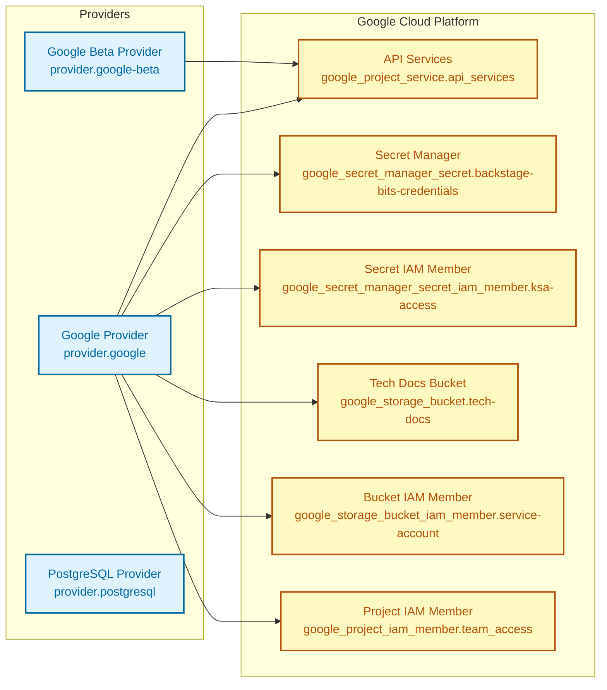

<!-- BEGIN_TF_DOCS -->
# terraform repo for backstage
Terraform Repo for backstage

[Terraform Docs](https://terraform-docs.io/) created by running:

```Shell
docker run --rm --volume "$(pwd):/terraform-docs" -u $(id -u) quay.io/terraform-docs/terraform-docs:latest --output-file README.md --output-mode inject /terraform-docs
```

Remember update the dependency lock file for different architectures:

```Shell
terraform providers lock -platform=linux_amd64 -platform=darwin_amd64 -platform=darwin_arm64 -platform=windows_amd64
```

## Requirements

| Name | Version |
|------|---------|
| <a name="requirement_terraform"></a> [terraform](#requirement\_terraform) | 1.10.5 |
| <a name="requirement_google"></a> [google](#requirement\_google) | 7.12.0 |
| <a name="requirement_google-beta"></a> [google-beta](#requirement\_google-beta) | 7.12.0 |
| <a name="requirement_postgresql"></a> [postgresql](#requirement\_postgresql) | 1.25.0 |

## Providers

| Name | Version |
|------|---------|
| <a name="provider_google"></a> [google](#provider\_google) | 7.12.0 |
| <a name="provider_postgresql.database"></a> [postgresql.database](#provider\_postgresql.database) | 1.25.0 |

## Modules

| Name | Source | Version |
|------|--------|---------|
| <a name="module_db_service_accounts"></a> [db\_service\_accounts](#module\_db\_service\_accounts) | terraform-google-modules/service-accounts/google | 4.6.0 |
| <a name="module_postgres"></a> [postgres](#module\_postgres) | GoogleCloudPlatform/sql-db/google//modules/postgresql | 27.0.0 |

## Resources

| Name | Type |
|------|------|
| [google_project_iam_member.sa_access](https://registry.terraform.io/providers/hashicorp/google/7.12.0/docs/resources/project_iam_member) | resource |
| [google_project_iam_member.team_access](https://registry.terraform.io/providers/hashicorp/google/7.12.0/docs/resources/project_iam_member) | resource |
| [google_project_service.api_services](https://registry.terraform.io/providers/hashicorp/google/7.12.0/docs/resources/project_service) | resource |
| [google_secret_manager_secret.backstage-bits-credentials](https://registry.terraform.io/providers/hashicorp/google/7.12.0/docs/resources/secret_manager_secret) | resource |
| [google_secret_manager_secret_iam_member.ksa-access](https://registry.terraform.io/providers/hashicorp/google/7.12.0/docs/resources/secret_manager_secret_iam_member) | resource |
| [google_service_account_iam_member.db_workload_identity](https://registry.terraform.io/providers/hashicorp/google/7.12.0/docs/resources/service_account_iam_member) | resource |
| [google_storage_bucket.tech-docs](https://registry.terraform.io/providers/hashicorp/google/7.12.0/docs/resources/storage_bucket) | resource |
| [google_storage_bucket_iam_member.service-account](https://registry.terraform.io/providers/hashicorp/google/7.12.0/docs/resources/storage_bucket_iam_member) | resource |
| [postgresql_grant.database_connect](https://registry.terraform.io/providers/cyrilgdn/postgresql/1.25.0/docs/resources/grant) | resource |
| [postgresql_grant.schema_usage_create](https://registry.terraform.io/providers/cyrilgdn/postgresql/1.25.0/docs/resources/grant) | resource |
| [postgresql_grant.table_permissions](https://registry.terraform.io/providers/cyrilgdn/postgresql/1.25.0/docs/resources/grant) | resource |
| [google_client_config.current](https://registry.terraform.io/providers/hashicorp/google/7.12.0/docs/data-sources/client_config) | data source |
| [google_project.core](https://registry.terraform.io/providers/hashicorp/google/7.12.0/docs/data-sources/project) | data source |
| [google_project.gke](https://registry.terraform.io/providers/hashicorp/google/7.12.0/docs/data-sources/project) | data source |

## Inputs

| Name | Description | Type | Default | Required |
|------|-------------|------|---------|:--------:|
| <a name="input_core_project"></a> [core\_project](#input\_core\_project) | GCP project to use for the default/primary provider | `string` | n/a | yes |
| <a name="input_env"></a> [env](#input\_env) | Label for the environment or tier you are working in. Typically dev, staging, or prod | `string` | n/a | yes |
| <a name="input_gke_project"></a> [gke\_project](#input\_gke\_project) | GCP project Where GKE clusters are running | `string` | n/a | yes |
| <a name="input_google_secret_manager_secrets"></a> [google\_secret\_manager\_secrets](#input\_google\_secret\_manager\_secrets) | Map of secrets to create in Google Secret Manager in the format of { secret\_name = {  service = string, type = string } } | <pre>map(object({<br/>    service = string<br/>    type    = string<br/>  }))</pre> | n/a | yes |
| <a name="input_namespace"></a> [namespace](#input\_namespace) | Kubernetes Namespace to deploy resources into | `string` | n/a | yes |
| <a name="input_additional_databases"></a> [additional\_databases](#input\_additional\_databases) | A list of databases to be created in your cluster | <pre>list(object({<br/>    name      = string<br/>    charset   = string<br/>    collation = string<br/>  }))</pre> | `[]` | no |
| <a name="input_api_services"></a> [api\_services](#input\_api\_services) | List of API services to enable | `list(string)` | <pre>[<br/>  "compute.googleapis.com",<br/>  "monitoring.googleapis.com",<br/>  "cloudidentity.googleapis.com",<br/>  "iam.googleapis.com",<br/>  "iap.googleapis.com",<br/>  "iamcredentials.googleapis.com",<br/>  "sts.googleapis.com",<br/>  "secretmanager.googleapis.com",<br/>  "sqladmin.googleapis.com"<br/>]</pre> | no |
| <a name="input_cloudsql_tier"></a> [cloudsql\_tier](#input\_cloudsql\_tier) | CloudSQL tier to use | `string` | `"db-g1-small"` | no |
| <a name="input_database_flags"></a> [database\_flags](#input\_database\_flags) | List of database flags to set on the CloudSQL instance | <pre>list(object({<br/>    name  = string<br/>    value = string<br/>  }))</pre> | `[]` | no |

## Outputs

No outputs.
<!-- END_TF_DOCS -->


