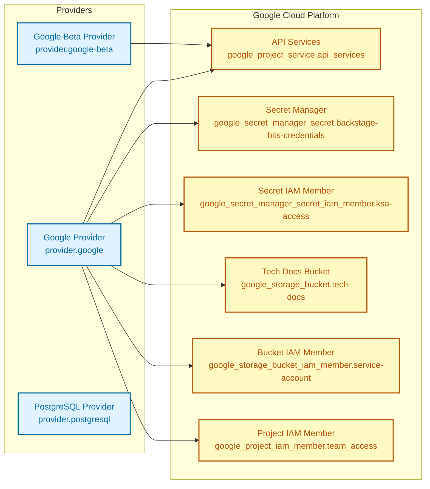

```mermaid
---
query: architecture diagram
references:
  - "File: /Untitled-2"
  - "File: /deployment/dev/terraform/locals.tf"
  - "File: /deployment/dev/terraform/team-access.tf"
  - "File: /deployment/dev/terraform/terraform.tf"
  - "File: /deployment/dev/terraform/variables.tf"
  - "File: /deployment/dev/terraform/README.md"
generationTime: 2025-04-16T14:51:23.702Z
---
flowchart LR
        subgraph Google Cloud Platform
                direction TB
                A1["API Services<br>google_project_service.api_services"]:::resource
                A2["Secret Manager<br>google_secret_manager_secret.backstage-bits-credentials"]:::resource
                A3["Secret IAM Member<br>google_secret_manager_secret_iam_member.ksa-access"]:::resource
                A4["Tech Docs Bucket<br>google_storage_bucket.tech-docs"]:::resource
                A5["Bucket IAM Member<br>google_storage_bucket_iam_member.service-account"]:::resource
                A6["Project IAM Member<br>google_project_iam_member.team_access"]:::resource
        end

        subgraph Providers
                direction TB
                P1["Google Provider<br>provider.google"]:::provider
                P2["Google Beta Provider<br>provider.google-beta"]:::provider
                P3["PostgreSQL Provider<br>provider.postgresql"]:::provider
        end

        %% Relationships
        P1 --> A1
        P1 --> A2
        P1 --> A3
        P1 --> A4
        P1 --> A5
        P1 --> A6
        P2 --> A1

        %% Styling
        classDef resource fill:#fef9c3,stroke:#b45309,stroke-width:2px,color:#b45309;
        classDef provider fill:#e0f2fe,stroke:#0369a1,stroke-width:2px,color:#0369a1;

        %% Layout
            linkStyle default interpolate basis;
```
